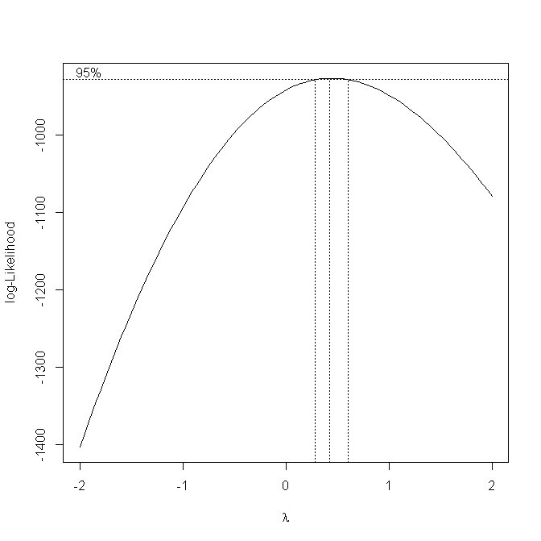
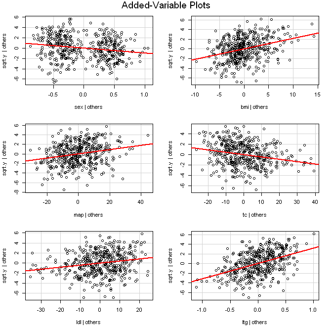

# Linear Regression Model For Diabetes Progression
### Materials and Methods
&nbsp;&nbsp;&nbsp;&nbsp;&nbsp;&nbsp;To analyze the data of diabetes progression with the ten covariates, including age `AGE`, sex `SEX`, body mass index `BMI`, average blood pressure `MAP`, and six blood serum measurements `TC`, `LDL`, `HDL`, `TCH`, `LTG`, and `GLU`, R software was utilized in generating least squares estimates.
### Analysis

&nbsp;&nbsp;&nbsp;&nbsp;&nbsp;&nbsp;We begin by fitting the full model:

&nbsp;&nbsp;&nbsp;&nbsp;&nbsp;&nbsp;The scatterplots and correlations of the response versus the predictors show moderate linear relationships overall. As can be seen in [**_Table A1_**](#Table-A1), the predictor with the highest correlation is `BMI` (0.5864501) and the predictor least correlated with the response is `SEX` (0.043062). Looking at the correlations of the predictors amongst themselves it appears that most predictors are, moderately, well behaved with most correlations less than 0.55. The only exceptions are `LDL` with `TC` (0.896663), `HDL` with `TCH` (-0.73849), `LDL` with `TCH` (0.659817), and `LTG` with `TCH` (0.617859). These correlations are exceptionally high.

&nbsp;&nbsp;&nbsp;&nbsp;&nbsp;&nbsp;Moving on to verify the model assumptions, the normality and linearity were then investigated. The QQ-plot of the residuals shows the points hugging the line fairly well, and the histogram of the residuals resembles a normal curve. Also, plots of the residuals versus the fitted values and residuals versus the predictors show no strong curvilinear patterns, satisfying the linearity assumption. In addition, a Shapiro-Wilk test for normality results in a p-value of 0.6163, so we would conclude that the data is consistent with that of a normal distribution. As is typical, checking the independence of the error terms is difficult, but performing a Durbin-Watson test on the model produces a statistic of 2.028543 and a p-value of 0.748, which is not significant, and we conclude that the autocorrelation of the errors is zero and the error terms are independent. Next, verifying the constant error variance assumption we again look to the residual plots. The plots of the residuals versus the predictors do show slight cone shaped patterns for most of the predictors suggesting non-constant error variance. The plots of the residuals versus the fitted values also show the same faint cone pattern. The residual plots implication of non-constant error variance is confirmed by conducting a BP test. The resulting significant p-value of 0.01248 with a test statistic of 22.5622 confirms the residual plots suggestion of non-constant error variance. Although remedial measures will need to be implemented, reduction of the number of explanatory variables is first performed via best subsets and stepwise regression. The estimated parameters for the full model and their respective p-values can be seen below in [**_Table A2_**](#Table-A2).

&nbsp;&nbsp;&nbsp;&nbsp;&nbsp;&nbsp;Best subsets selection is then performed using the smallest Mallow  statistic as the decision criteria. The model with smallest  value (5.560186) contains the six predictors: `SEX`, `BMI`, `MAP`, `TC`, `LDL`, and `LTG`. Forward and backward stepwise selection is also carried out. Both procedures resulted in the same model as that chosen by best subset selection. Now that we have a reduced model we can see that the same problems we had for the full model carry over into this reduced model. A formal BP test is performed to confirm the violation of constant error variance; the results provide a p-value of 0.003891 which strongly suggest the variance is non-constant. A correlation test for normality is also performed to formally test if the data errors are normally distributed. The insignificant p-value 0.6718 again suggests the data is normally distributed. Since the normality assumption is satisfied, but the constant error variance assumption has been violated, transformations on the response would be the next step. The Box-Cox procedure is then performed to find the best response transformation. The results in [**_Plot A3_**](#Plot-A3) suggest a transformation close to that of the square root. Several other transformations were also performed but the square root transformation best improved the non-constant variance issue. The BP test is no longer significant at the 0.05 level with a p-value of 0.1062. Partial regression plots can be seen in [**_Plot A4_**](#Plot-A4), and show that all of our predictors have slopes noticeably different from zero with no strong curvilinear patterns. Based on this all predictors in the tentative model are useful with no curvilinear effects present. Interaction plots were also created, nothing of interest resulted. However, multicolinearity between the predictors is still an issue. The search for outliers and influential cases is taken on next.

&nbsp;&nbsp;&nbsp;&nbsp;&nbsp;&nbsp;Turning our attention to outliers examining the studentized and the deleted studentized residuals reveals that no response outliers are present at the 0.05 level in a Bonferroni test. Looking for outlying predictor observations finds 25 cases where leverages exceed  and would be considered outliers ([**_Table A5_**](#Table-A5)). Checking the influence on a single fitted value, the DFFITS shows that there are 6 influential records when DFFIT values larger than $2\sqrt{\frac{p}{n}}=2  ([**_Table A6_**](#Table-A6)). If we were to appeal to Cook’s Distance values to find cases that have influence on all fitted values we see that none are present since the largest Cook’s D value of 0.02463074 is only in the 0.00001541452th percentile of an  distribution. Checking the influence on regression coefficients using the DFBETAS finds that there are several cases for each predictor where the DFBETA values are larger than  ([**_Table A7_**](#Table-A7)). Assuming that there were no measurement errors while collecting the data, the outliers and influential cases mentioned above cannot be removed from the data and are only noteworthy. The ANOVA table and a table of the estimated parameter values can be seen in [**_Table A8_**](#Table-A8) and [**_Table A9_**](#Table-A9). The Variance Inflation Factor was also computed ([**_Table A10_**](#Table-A10)) to make sure to what extent multicolinearity might have. The results show all of the predictors with VIF values below 10, so multicolinearity isn’t influencing the least squares estimates. However, VIF values for `TC` and `LDL` are much higher than the others. This goes back to `TC` and `LDL` being highly correlated with one another (0.8966). Also LTG has a moderately higher VIF value than the other predictors; this would be since `LTG` and `TC` are moderately correlated (0.5155). The mean VIF value is 3.735823, which is greater than one, so serious multicolinearity persists. We can also see multicolinearity showing up in the marginal tests in the ANOVA table ([**_Table A8_**](#Table-A8)). The p-values for `SEX`, `TC`, and `LDL` are not significant at the 0.05 level, but the overall F-test is.
### Conclusion
&nbsp;&nbsp;&nbsp;&nbsp;&nbsp;&nbsp;The final model contains the six predictor variables `SEX`, `BMI`, `MAP`, `TC`, `LDL`, and `LTG` and the square root transformation on the response the final can be written as:
  

&nbsp;&nbsp;&nbsp;&nbsp;&nbsp;&nbsp;Even though strong multicolinearity is still present this model should be useful for prediction as long as the data being used for prediction follows the same kind of multicolinearity structure. Since prediction is of interest the Implementation of Ridge Regression was foregone, although it would be a helpful remedial measure for the persistence of multicolinearity.

### Appendix
#### **_Table A1_**
#### Correlation Matrix
| | y | age | sex | bmi | map | tc | ldl | hdl | tch | ltg | glu |
| :--- | :---: | :---: | :---: | :---: | :---: | :---: |:---: |:---: |:---: |:---: | ---: |
| **y**   | 1.000 | 0.188 | 0.043 | 0.586 | 0.441 | 0.212 | 0.174 | -0.395| 0.430 | 0.566 |0.382 |
| **age** | 0.188 | 1.000 | 0.174 | 0.185 | 0.335 | 0.260 | 0.219 | -0.075 | 0.204 | 0.271 | 0.302 |
| **sex** | 0.043 | 0.174 | 1.000 | 0.088 | 0.241 | 0.035 | 0.143 | -0.379 | 0.332 | 0.150 | 0.208 |
| **bmi** | 0.586 | 0.185 | 0.088 | 1.000 | 0.395 | 0.250 | 0.261 | -0.367 | 0.414 | 0.446 | 0.389 |
| **map** | 0.441 | 0.335 | 0.241 | 0.395 | 1.000 | 0.242 | 0.186 | -0.179 | 0.258 | 0.393 | 0.390 |
| **tc**  | 0.212 | 0.260 | 0.035 | 0.250 | 0.242 | 1.000 | 0.897 | 0.052 | 0.542 | 0.516 | 0.326 |
| **ldl** | 0.174 | 0.219 | 0.143 | 0.261 | 0.186 | 0.897 | 1.000 | -0.196 | 0.660 | 0.318 | 0.291 |
| **hdl** | -0.395 | -0.075 | -0.379 | -0.367 | -0.179 | 0.052 | -0.196 | 1.000 | -0.738 | -0.399 | -0.274 |
| **tch** | 0.430 | 0.204 | 0.332 | 0.414 | 0.258 | 0.542 | 0.660 | -0.738 | 1.000 | 0.618 | 0.417 |
| **ltg** | 0.566 | 0.271 | 0.150 | 0.446 | 0.393 | 0.516 | 0.318 | -0.399 | 0.618 | 1.000 | 0.465 |
| **glu** | 0.382 | 0.302 | 0.208 | 0.389 | 0.390 | 0.326 | 0.291 | -0.274 | 0.417 | 0.465 | 1.000 |

#### **_Table A2_**
#### Full Model Estimates and Standard Errors

| | Estimate | Std. Error | t Value| Pr(>\|t\|) |
| :--- | :---: | :---: | :---: | :---: |
| **(Intercept)** | -334.567 | 67.45462 | -4.96 | 1.02E-06 |
| **age** | -0.03636 | 0.21704 | -0.168 | 0.867031 |
| **sex** | -22.8597 | 5.83582 | -3.917 | 0.000104 |
| **bmi** | 5.60296 | 0.71711 | 7.813 | 4.30E-14 |
| **map** | 1.11681 | 0.22524 | 4.958 | 1.02E-06 |
| **tc** | -1.09 | 0.57333 | -1.901 | 0.057948 |
| **ldl** | 0.74645 | 0.53083 | 1.406 | 0.16039 |
| **hdl** | 0.372 | 0.78246 | 0.475 | 0.634723 |
| **ltg** | 68.48312 | 15.66972 | 4.37 | 1.56E-05 |
| **tch** | 6.53383 | 5.95864 | 1.097 | 0.273459 |
| **glu** | 0.28012 | 0.27331 | 1.025 | 0.30599 |

#### **_Plot A3_**
#### Box-Cox Results

#### **_Plot A4_**

#### **_Table A5_**
#### Table of Significant Leverages

<table>
<tr>
<th style='border:solid windowtext 1.0pt'>Observation</th>
<th style='border:solid windowtext 1.0pt'>Leverage</th>
</tr>
<tr>
<td style='border-left:solid windowtext 1.0pt;border-right:solid windowtext 1.0pt'> 24 <td style='border-right:solid windowtext 1.0pt'> 0.046248 </td>
</tr>
<tr>
<td style='border-left:solid windowtext 1.0pt;border-right:solid windowtext 1.0pt'> 36 </td><td style='border-right:solid windowtext 1.0pt'> 0.034963 </td>
</tr>
<tr>
<td style='border-left:solid windowtext 1.0pt;border-right:solid windowtext 1.0pt'> 59 </td><td style='border-right:solid windowtext 1.0pt'> 0.035837 </td>
</tr>
<tr>
<td style='border-left:solid windowtext 1.0pt;border-right:solid windowtext 1.0pt'> 73 </td><td style='border-right:solid windowtext 1.0pt'> 0.032758 </td>
</tr>
<tr>
<td style='border-left:solid windowtext 1.0pt;border-right:solid windowtext 1.0pt'> 124 </td><td style='border-right:solid windowtext 1.0pt'> 0.046678 </td>
</tr>
<tr>
<td style='border-left:solid windowtext 1.0pt;border-right:solid windowtext 1.0pt'> 146 </td><td style='border-right:solid windowtext 1.0pt'> 0.032218 </td>
</tr>
<tr>
<td style='border-left:solid windowtext 1.0pt;border-right:solid windowtext 1.0pt'> 170 </td><td style='border-right:solid windowtext 1.0pt'> 0.040725 </td>
</tr>
<tr>
<td style='border-left:solid windowtext 1.0pt;border-right:solid windowtext 1.0pt'> 231 </td><td style='border-right:solid windowtext 1.0pt'> 0.047138 </td>
</tr>
<tr>
<td style='border-left:solid windowtext 1.0pt;border-right:solid windowtext 1.0pt'> 257 </td><td style='border-right:solid windowtext 1.0pt'> 0.046666 </td>
</tr>
<tr>
<td style='border-left:solid windowtext 1.0pt;border-right:solid windowtext 1.0pt'> 261 </td><td style='border-right:solid windowtext 1.0pt'> 0.037657 </td>
</tr>
<tr>
<td style='border-left:solid windowtext 1.0pt;border-right:solid windowtext 1.0pt'> 262 </td><td style='border-right:solid windowtext 1.0pt'> 0.046271 </td>
</tr>
<tr>
<td style='border-left:solid windowtext 1.0pt;border-right:solid windowtext 1.0pt'> 267 </td><td style='border-right:solid windowtext 1.0pt'> 0.037106 </td>
</tr>
<tr>
<td style='border-left:solid windowtext 1.0pt;border-right:solid windowtext 1.0pt'> 323 </td><td style='border-right:solid windowtext 1.0pt'> 0.034497 </td>
</tr>
<tr>
<td style='border-left:solid windowtext 1.0pt;border-right:solid windowtext 1.0pt'> 324 </td><td style='border-right:solid windowtext 1.0pt'> 0.03468 </td>
</tr>
<tr>
<td style='border-left:solid windowtext 1.0pt;border-right:solid windowtext 1.0pt'> 341 </td><td style='border-right:solid windowtext 1.0pt'> 0.036855 </td>
</tr>
<tr>
<td style='border-left:solid windowtext 1.0pt;border-right:solid windowtext 1.0pt'> 353 </td><td style='border-right:solid windowtext 1.0pt'> 0.032908 </td>
</tr>
<tr>
<td style='border-left:solid windowtext 1.0pt;border-right:solid windowtext 1.0pt'> 354 </td><td style='border-right:solid windowtext 1.0pt'> 0.059066 </td>
</tr>
<tr>
<td style='border-left:solid windowtext 1.0pt;border-right:solid windowtext 1.0pt'> 367 </td><td style='border-right:solid windowtext 1.0pt'> 0.033165 </td>
</tr>
<tr>
<td style='border-left:solid windowtext 1.0pt;border-right:solid windowtext 1.0pt'> 368 </td><td style='border-right:solid windowtext 1.0pt'> 0.040786 </td>
</tr>
<tr>
<td style='border-left:solid windowtext 1.0pt;border-right:solid windowtext 1.0pt'> 372 </td><td style='border-right:solid windowtext 1.0pt'> 0.03641 </td>
</tr>
<tr>
<td style='border-left:solid windowtext 1.0pt;border-right:solid windowtext 1.0pt'> 383 </td><td style='border-right:solid windowtext 1.0pt'> 0.033791 </td>
</tr>
<tr>
<td style='border-left:solid windowtext 1.0pt;border-right:solid windowtext 1.0pt'> 395 </td><td style='border-right:solid windowtext 1.0pt'> 0.035862 </td>
</tr>
<tr>
<td style='border-left:solid windowtext 1.0pt;border-right:solid windowtext 1.0pt'> 406 </td><td style='border-right:solid windowtext 1.0pt'> 0.043196 </td>
</tr>
<tr>
<td style='border-left:solid windowtext 1.0pt;border-right:solid windowtext 1.0pt'> 409 </td><td style='border-right:solid windowtext 1.0pt'> 0.036412 </td>
</tr>
<tr>
<td style='border:solid windowtext 1.0pt;border-top:none'> 442 </td><td style='border-right:solid windowtext 1.0pt;border-bottom:solid windowtext 1.0pt'> 0.039624 </td>
</tr>
<tr>
</tr>
</table>

#### **_Table A6_**
#### Table of Significant DFFITS

<table>
<tr>
<th style='border-left:solid windowtext 1.0pt;border:solid windowtext 1.0pt'>Observation</th>
<th style='border:solid windowtext 1.0pt'>DFFITS</th>
</tr>
<tr>
<td style='border-left:solid windowtext 1.0pt;border-right:solid windowtext 1.0pt' align='right'> 30 </td><td style='border-right:solid windowtext 1.0pt' align='right'> 0.295193 </td>
<tr>
</tr>
<td style='border-left:solid windowtext 1.0pt;border-right:solid windowtext 1.0pt' align='right'> 59 </td><td style='border-right:solid windowtext 1.0pt' align='right'> 0.300946 </td>
<tr>
</tr>
<td style='border-left:solid windowtext 1.0pt;border-right:solid windowtext 1.0pt' align='right'> 78 </td><td style='border-right:solid windowtext 1.0pt' align='right'> 0.258292 </td>
<tr>
</tr>
<td style='border-left:solid windowtext 1.0pt;border-right:solid windowtext 1.0pt' align='right'> 111 </td><td style='border-right:solid windowtext 1.0pt' align='right'> 0.274661 </td>
<tr>
</tr>
<td style='border-left:solid windowtext 1.0pt;border-right:solid windowtext 1.0pt' align='right'> 305 </td><td style='border-right:solid windowtext 1.0pt' align='right'> 0.400494 </td>
<tr>
</tr>
<td style='border-left:solid windowtext 1.0pt;border-right:solid windowtext 1.0pt;border-bottom:solid windowtext 1.0pt' align='right'> 388 </td><td style='border-right:solid windowtext 1.0pt;border-bottom:solid windowtext 1.0pt' align='right'> 0.330738 </td>
</tr>
</table>

#### **_Table A7_**
####  DFBETAS for Predictors

<table >
<tr>
<th colspan="2" style='border:solid windowtext 1.0pt'>(Intercept)</th>
<th colspan="2" style='border:solid windowtext 1.0pt'> Sex </th>
<th colspan="2" style='border:solid windowtext 1.0pt'> BMI </th>
<th colspan="2" style='border:solid windowtext 1.0pt'> MAP </th>
<th colspan="2" style='border:solid windowtext 1.0pt'> TC </th>
<th colspan="2" style='border:solid windowtext 1.0pt'> LDL</th>
<th colspan="2" style='border:solid windowtext 1.0pt'> LTG </th>
</tr>
<tr style='border:solid windowtext 1.0pt;border-left:none;border-right:none;padding:0in 5.4pt 0in 5.4pt;height:15.0pt;font-weight:bold'>
<th style='border-left:solid windowtext 1.0pt;border-bottom:solid windowtext 1.0pt'> Obs </th><th style='border-right:solid windowtext 1.0pt;border-bottom:solid windowtext 1.0pt'> DFBETAS </th><th style='border-bottom:solid windowtext 1.0pt'> Obs </th><th style='border-right:solid windowtext 1.0pt;border-bottom:solid windowtext 1.0pt'> DFBETAS </th><th style='border-bottom:solid windowtext 1.0pt'> Obs </th><th style='border-right:solid windowtext 1.0pt;border-bottom:solid windowtext 1.0pt'> DFBETAS </th><th style='border-bottom:solid windowtext 1.0pt'> Obs </th><th style='border-right:solid windowtext 1.0pt;border-bottom:solid windowtext 1.0pt'> DFBETAS </th><th style='border-bottom:solid windowtext 1.0pt'> Obs </th><th style='border-right:solid windowtext 1.0pt;border-bottom:solid windowtext 1.0pt'> DFBETAS </th><th style='border-bottom:solid windowtext 1.0pt'> Obs </th><th style='border-right:solid windowtext 1.0pt;border-bottom:solid windowtext 1.0pt'> DFBETAS </th><th style='border-bottom:solid windowtext 1.0pt'> Obs </th><th style='border-right:solid windowtext 1.0pt;border-bottom:solid windowtext 1.0pt'> DFBETAS </th>
</tr>
<tr>
<td style='border-left:solid windowtext 1.0pt;'>30</td><td style='border-right:solid windowtext 1.0pt'>0.1041</td><td>30</td><td style='border-right:solid windowtext 1.0pt'>0.1096</td><td>28</td><td style='border-right:solid windowtext 1.0pt'>0.1452</td><td>38</td><td style='border-right:solid windowtext 1.0pt'>0.1313</td><td>30</td><td style='border-right:solid windowtext 1.0pt'>0.1152</td><td>30</td><td style='border-right:solid windowtext 1.0pt'>0.1870</td><td>8</td><td style='border-right:solid windowtext 1.0pt'>0.1196</td>
</tr>
<tr>
<td style='border-left:solid windowtext 1.0pt;'>58</td><td style='border-right:solid windowtext 1.0pt'>0.0972</td><td>57</td><td style='border-right:solid windowtext 1.0pt'>0.1680</td><td>33</td><td style='border-right:solid windowtext 1.0pt'>0.1438</td><td>40</td><td style='border-right:solid windowtext 1.0pt'>0.0962</td><td>43</td><td style='border-right:solid windowtext 1.0pt'>0.1105</td><td>59</td><td style='border-right:solid windowtext 1.0pt'>0.2330</td><td>10</td><td style='border-right:solid windowtext 1.0pt'>0.1028</td>
</tr>
<tr>
<td style='border-left:solid windowtext 1.0pt;'>78</td><td style='border-right:solid windowtext 1.0pt'>0.2249</td><td>79</td><td style='border-right:solid windowtext 1.0pt'>0.0977</td><td>57</td><td style='border-right:solid windowtext 1.0pt'>0.1023</td><td>57</td><td style='border-right:solid windowtext 1.0pt'>0.1205</td><td>57</td><td style='border-right:solid windowtext 1.0pt'>0.1590</td><td>73</td><td style='border-right:solid windowtext 1.0pt'>0.1164</td><td>56</td><td style='border-right:solid windowtext 1.0pt'>0.1041</td>
</tr>
<tr>
<td style='border-left:solid windowtext 1.0pt;'>93</td><td style='border-right:solid windowtext 1.0pt'>0.1042</td><td>93</td><td style='border-right:solid windowtext 1.0pt'>0.1588</td><td>79</td><td style='border-right:solid windowtext 1.0pt'>0.1261</td><td>78</td><td style='border-right:solid windowtext 1.0pt'>0.1091</td><td>59</td><td style='border-right:solid windowtext 1.0pt'>0.2206</td><td>93</td><td style='border-right:solid windowtext 1.0pt'>0.1044</td><td>57</td><td style='border-right:solid windowtext 1.0pt'>0.2028</td>
</tr>
<tr>
<td style='border-left:solid windowtext 1.0pt;'>107</td><td style='border-right:solid windowtext 1.0pt'>0.0991</td><td>111</td><td style='border-right:solid windowtext 1.0pt'>0.1428</td><td>98</td><td style='border-right:solid windowtext 1.0pt'>0.1013</td><td>93</td><td style='border-right:solid windowtext 1.0pt'>0.3390</td><td>73</td><td style='border-right:solid windowtext 1.0pt'>0.1391</td><td>111</td><td style='border-right:solid windowtext 1.0pt'>0.1188</td><td>59</td><td style='border-right:solid windowtext 1.0pt'>0.0962</td>
</tr>
<tr>
<td style='border-left:solid windowtext 1.0pt;'>111</td><td style='border-right:solid windowtext 1.0pt'>0.1447</td><td>142</td><td style='border-right:solid windowtext 1.0pt'>0.0968</td><td>100</td><td style='border-right:solid windowtext 1.0pt'>0.1205</td><td>153</td><td style='border-right:solid windowtext 1.0pt'>0.1081</td><td>79</td><td style='border-right:solid windowtext 1.0pt'>0.1368</td><td>124</td><td style='border-right:solid windowtext 1.0pt'>0.1630</td><td>79</td><td style='border-right:solid windowtext 1.0pt'>0.1853</td>
</tr>
<tr>
<td style='border-left:solid windowtext 1.0pt;'>132</td><td style='border-right:solid windowtext 1.0pt'>0.1294</td><td>157</td><td style='border-right:solid windowtext 1.0pt'>0.1468</td><td>103</td><td style='border-right:solid windowtext 1.0pt'>0.1119</td><td>210</td><td style='border-right:solid windowtext 1.0pt'>0.1580</td><td>103</td><td style='border-right:solid windowtext 1.0pt'>0.1132</td><td>142</td><td style='border-right:solid windowtext 1.0pt'>0.1321</td><td>103</td><td style='border-right:solid windowtext 1.0pt'>0.0983</td>
</tr>
<tr>
<td style='border-left:solid windowtext 1.0pt;'>170</td><td style='border-right:solid windowtext 1.0pt'>0.1095</td><td>191</td><td style='border-right:solid windowtext 1.0pt'>0.1219</td><td>105</td><td style='border-right:solid windowtext 1.0pt'>0.1009</td><td>218</td><td style='border-right:solid windowtext 1.0pt'>0.1135</td><td>111</td><td style='border-right:solid windowtext 1.0pt'>0.1218</td><td>153</td><td style='border-right:solid windowtext 1.0pt'>0.1272</td><td>111</td><td style='border-right:solid windowtext 1.0pt'>0.2328</td>
</tr>
<tr>
<td style='border-left:solid windowtext 1.0pt;'>188</td><td style='border-right:solid windowtext 1.0pt'>0.1406</td><td>212</td><td style='border-right:solid windowtext 1.0pt'>0.1068</td><td>139</td><td style='border-right:solid windowtext 1.0pt'>0.1167</td><td>231</td><td style='border-right:solid windowtext 1.0pt'>0.1263</td><td>142</td><td style='border-right:solid windowtext 1.0pt'>0.1135</td><td>165</td><td style='border-right:solid windowtext 1.0pt'>0.0980</td><td>142</td><td style='border-right:solid windowtext 1.0pt'>0.1132</td>
</tr>
<tr>
<td style='border-left:solid windowtext 1.0pt;'>200</td><td style='border-right:solid windowtext 1.0pt'>0.1023</td><td>219</td><td style='border-right:solid windowtext 1.0pt'>0.1078</td><td>148</td><td style='border-right:solid windowtext 1.0pt'>0.1502</td><td>253</td><td style='border-right:solid windowtext 1.0pt'>0.1131</td><td>153</td><td style='border-right:solid windowtext 1.0pt'>0.0985</td><td>191</td><td style='border-right:solid windowtext 1.0pt'>0.1164</td><td>170</td><td style='border-right:solid windowtext 1.0pt'>0.1000</td>
</tr>
<tr>
<td style='border-left:solid windowtext 1.0pt;'>206</td><td style='border-right:solid windowtext 1.0pt'>0.1013</td><td>237</td><td style='border-right:solid windowtext 1.0pt'>0.1399</td><td>195</td><td style='border-right:solid windowtext 1.0pt'>0.1180</td><td>257</td><td style='border-right:solid windowtext 1.0pt'>0.1011</td><td>165</td><td style='border-right:solid windowtext 1.0pt'>0.0996</td><td>200</td><td style='border-right:solid windowtext 1.0pt'>0.1016</td><td>186</td><td style='border-right:solid windowtext 1.0pt'>0.1516</td>
</tr>
<tr>
<td style='border-left:solid windowtext 1.0pt;'>255</td><td style='border-right:solid windowtext 1.0pt'>0.1068</td><td>260</td><td style='border-right:solid windowtext 1.0pt'>0.1547</td><td>200</td><td style='border-right:solid windowtext 1.0pt'>0.1315</td><td>260</td><td style='border-right:solid windowtext 1.0pt'>0.1776</td><td>191</td><td style='border-right:solid windowtext 1.0pt'>0.1302</td><td>210</td><td style='border-right:solid windowtext 1.0pt'>0.1471</td><td>188</td><td style='border-right:solid windowtext 1.0pt'>0.0971</td>
</tr>
<tr>
<td style='border-left:solid windowtext 1.0pt;'>264</td><td style='border-right:solid windowtext 1.0pt'>0.1138</td><td>264</td><td style='border-right:solid windowtext 1.0pt'>0.0960</td><td>210</td><td style='border-right:solid windowtext 1.0pt'>0.1043</td><td>275</td><td style='border-right:solid windowtext 1.0pt'>0.1324</td><td>210</td><td style='border-right:solid windowtext 1.0pt'>0.1745</td><td>219</td><td style='border-right:solid windowtext 1.0pt'>0.1442</td><td>191</td><td style='border-right:solid windowtext 1.0pt'>0.1114</td>
</tr>
<tr>
<td style='border-left:solid windowtext 1.0pt;'>284</td><td style='border-right:solid windowtext 1.0pt'>0.1528</td><td>275</td><td style='border-right:solid windowtext 1.0pt'>0.1614</td><td>219</td><td style='border-right:solid windowtext 1.0pt'>0.1396</td><td>290</td><td style='border-right:solid windowtext 1.0pt'>0.2304</td><td>219</td><td style='border-right:solid windowtext 1.0pt'>0.1385</td><td>240</td><td style='border-right:solid windowtext 1.0pt'>0.0955</td><td>200</td><td style='border-right:solid windowtext 1.0pt'>0.1072</td>
</tr>
<tr>
<td style='border-left:solid windowtext 1.0pt;'>290</td><td style='border-right:solid windowtext 1.0pt'>0.1000</td><td>290</td><td style='border-right:solid windowtext 1.0pt'>0.1424</td><td>245</td><td style='border-right:solid windowtext 1.0pt'>0.1208</td><td>296</td><td style='border-right:solid windowtext 1.0pt'>0.1007</td><td>239</td><td style='border-right:solid windowtext 1.0pt'>0.1049</td><td>253</td><td style='border-right:solid windowtext 1.0pt'>0.1057</td><td>206</td><td style='border-right:solid windowtext 1.0pt'>0.1155</td>
</tr>
<tr>
<td style='border-left:solid windowtext 1.0pt;'>298</td><td style='border-right:solid windowtext 1.0pt'>0.1478</td><td>296</td><td style='border-right:solid windowtext 1.0pt'>0.0961</td><td>253</td><td style='border-right:solid windowtext 1.0pt'>0.1063</td><td>305</td><td style='border-right:solid windowtext 1.0pt'>0.1636</td><td>240</td><td style='border-right:solid windowtext 1.0pt'>0.1202</td><td>255</td><td style='border-right:solid windowtext 1.0pt'>0.0971</td><td>211</td><td style='border-right:solid windowtext 1.0pt'>0.1033</td>
</tr>
<tr>
<td style='border-left:solid windowtext 1.0pt;'>355</td><td style='border-right:solid windowtext 1.0pt'>0.0952</td><td>339</td><td style='border-right:solid windowtext 1.0pt'>0.0968</td><td>257</td><td style='border-right:solid windowtext 1.0pt'>0.1840</td><td>329</td><td style='border-right:solid windowtext 1.0pt'>0.1582</td><td>260</td><td style='border-right:solid windowtext 1.0pt'>0.1383</td><td>260</td><td style='border-right:solid windowtext 1.0pt'>0.1540</td><td>219</td><td style='border-right:solid windowtext 1.0pt'>0.1330</td>
</tr>
<tr>
<td style='border-left:solid windowtext 1.0pt;'>380</td><td style='border-right:solid windowtext 1.0pt'>0.1022</td><td>380</td><td style='border-right:solid windowtext 1.0pt'>0.0967</td><td>260</td><td style='border-right:solid windowtext 1.0pt'>0.1202</td><td>338</td><td style='border-right:solid windowtext 1.0pt'>0.1157</td><td>261</td><td style='border-right:solid windowtext 1.0pt'>0.0983</td><td>275</td><td style='border-right:solid windowtext 1.0pt'>0.1159</td><td>275</td><td style='border-right:solid windowtext 1.0pt'>0.1120</td>
</tr>
<tr>
<td style='border-left:solid windowtext 1.0pt;'>383</td><td style='border-right:solid windowtext 1.0pt'>0.1217</td><td>381</td><td style='border-right:solid windowtext 1.0pt'>0.1584</td><td>275</td><td style='border-right:solid windowtext 1.0pt'>0.1339</td><td>341</td><td style='border-right:solid windowtext 1.0pt'>0.1566</td><td>275</td><td style='border-right:solid windowtext 1.0pt'>0.1260</td><td>305</td><td style='border-right:solid windowtext 1.0pt'>0.2069</td><td>362</td><td style='border-right:solid windowtext 1.0pt'>0.1201</td>
</tr>
<tr>
<td style='border-left:solid windowtext 1.0pt;'>388</td><td style='border-right:solid windowtext 1.0pt'>0.2330</td><td> </td><td style='border-right:solid windowtext 1.0pt'> </td><td>290</td><td style='border-right:solid windowtext 1.0pt'>0.1277</td><td>380</td><td style='border-right:solid windowtext 1.0pt'>0.1352</td><td>277</td><td style='border-right:solid windowtext 1.0pt'>0.1022</td><td>339</td><td style='border-right:solid windowtext 1.0pt'>0.1157</td><td>364</td><td style='border-right:solid windowtext 1.0pt'>0.1609</td>
</tr>
<tr>
<td style='border-left:solid windowtext 1.0pt;'>418</td><td style='border-right:solid windowtext 1.0pt'>0.1041</td><td> </td><td style='border-right:solid windowtext 1.0pt'> </td><td>291</td><td style='border-right:solid windowtext 1.0pt'>0.0983</td><td>381</td><td style='border-right:solid windowtext 1.0pt'>0.2237</td><td>305</td><td style='border-right:solid windowtext 1.0pt'>0.0964</td><td>354</td><td style='border-right:solid windowtext 1.0pt'>0.1070</td><td>383</td><td style='border-right:solid windowtext 1.0pt'>0.1756</td>
</tr>
<tr>
<td style='border-left:solid windowtext 1.0pt;'></td><td style='border-right:solid windowtext 1.0pt'> </td><td> </td><td style='border-right:solid windowtext 1.0pt'> </td><td>305</td><td style='border-right:solid windowtext 1.0pt'>0.1739</td><td>383</td><td style='border-right:solid windowtext 1.0pt'>0.1335</td><td>339</td><td style='border-right:solid windowtext 1.0pt'>0.0972</td><td>364</td><td style='border-right:solid windowtext 1.0pt'>0.1191</td><td>388</td><td style='border-right:solid windowtext 1.0pt'>0.1652</td>
</tr>
<tr>
<td style='border-left:solid windowtext 1.0pt;'></td><td style='border-right:solid windowtext 1.0pt'> </td><td> </td><td style='border-right:solid windowtext 1.0pt'> </td><td>329</td><td style='border-right:solid windowtext 1.0pt'>0.1837</td><td>388</td><td style='border-right:solid windowtext 1.0pt'>0.1117</td><td>354</td><td style='border-right:solid windowtext 1.0pt'>0.1078</td><td>383</td><td style='border-right:solid windowtext 1.0pt'>0.1311</td><td>418</td><td style='border-right:solid windowtext 1.0pt'>0.1088</td>
</tr>
<tr>
<td style='border-left:solid windowtext 1.0pt;'></td><td style='border-right:solid windowtext 1.0pt'> </td><td> </td><td style='border-right:solid windowtext 1.0pt'> </td><td>363</td><td style='border-right:solid windowtext 1.0pt'>0.1316</td><td>405</td><td style='border-right:solid windowtext 1.0pt'>0.1233</td><td>364</td><td style='border-right:solid windowtext 1.0pt'>0.1639</td><td>424</td><td style='border-right:solid windowtext 1.0pt'>0.1224</td><td></td><td style='border-right:solid windowtext 1.0pt'></td>
</tr>
<tr>
<td style='border-left:solid windowtext 1.0pt;'></td><td style='border-right:solid windowtext 1.0pt'> </td><td> </td><td style='border-right:solid windowtext 1.0pt'> </td><td>364</td><td style='border-right:solid windowtext 1.0pt'>0.1064</td><td>418</td><td style='border-right:solid windowtext 1.0pt'>0.1690</td><td>381</td><td style='border-right:solid windowtext 1.0pt'>0.1038</td><td>431</td><td style='border-right:solid windowtext 1.0pt'>0.1164</td><td><td style='border-right:solid windowtext 1.0pt'></td>
</tr>
<tr>
<td style='border-left:solid windowtext 1.0pt;'></td><td style='border-right:solid windowtext 1.0pt'> </td><td> </td><td style='border-right:solid windowtext 1.0pt'> </td><td>383</td><td style='border-right:solid windowtext 1.0pt'>0.1063</td><td> </td><td style='border-right:solid windowtext 1.0pt'> </td><td> </td><td style='border-right:solid windowtext 1.0pt'> </td><td> </td><td style='border-right:solid windowtext 1.0pt'> </td><td></td><td style='border-right:solid windowtext 1.0pt'></td>
</tr>
<tr>
<td style='border-left:solid windowtext 1.0pt;'></td><td style='border-right:solid windowtext 1.0pt'> </td><td> </td><td style='border-right:solid windowtext 1.0pt'> </td><td>388</td><td style='border-right:solid windowtext 1.0pt'>0.1617</td><td> </td><td style='border-right:solid windowtext 1.0pt'> </td><td> </td><td style='border-right:solid windowtext 1.0pt'> </td><td> </td><td style='border-right:solid windowtext 1.0pt'> </td><td></td><td style='border-right:solid windowtext 1.0pt'></td>
</tr>
<tr>
<td style='border-left:solid windowtext 1.0pt;'></td><td style='border-right:solid windowtext 1.0pt'> </td><td> </td><td style='border-right:solid windowtext 1.0pt'> </td><td>418</td><td style='border-right:solid windowtext 1.0pt'>0.2360</td><td> </td><td style='border-right:solid windowtext 1.0pt'> </td><td> </td><td style='border-right:solid windowtext 1.0pt'> </td><td> </td><td style='border-right:solid windowtext 1.0pt'> </td><td></td><td style='border-right:solid windowtext 1.0pt'></td>
</tr>
<tr>
<td style='border-left:solid windowtext 1.0pt;border-bottom:solid windowtext 1.0pt'></td><td style='border-right:solid windowtext 1.0pt;border-bottom:solid windowtext 1.0pt'> </td><td style='border-bottom:solid windowtext 1.0pt'> </td><td style='border-right:solid windowtext 1.0pt;border-bottom:solid windowtext 1.0pt'> </td><td style='border-bottom:solid windowtext 1.0pt'>424</td><td style='border-right:solid windowtext 1.0pt;border-bottom:solid windowtext 1.0pt'>0.1036</td><td style='border-bottom:solid windowtext 1.0pt'> </td><td style='border-right:solid windowtext 1.0pt;border-bottom:solid windowtext 1.0pt'> </td><td style='border-bottom:solid windowtext 1.0pt'> </td><td style='border-right:solid windowtext 1.0pt;border-bottom:solid windowtext 1.0pt'> </td><td style='border-bottom:solid windowtext 1.0pt'> </td><td style='border-right:solid windowtext 1.0pt;border-bottom:solid windowtext 1.0pt'> </td><td style='border-bottom:solid windowtext 1.0pt'></td><td style='border-right:solid windowtext 1.0pt;border-bottom:solid windowtext 1.0pt'></td>
</tr>
</table>

#### **_Table A8_**
#### Final Model: ANOVA Table
| | Df | Sum Sq | Mean Sq | F value | Pr(>F) |
| :--- | ---: | ---: | ---: | ---: | ---: |
| **sex** | 1 | 7.76 | 7.76 | 1.5443 | 0.2146 |
| **bmi** | 1 | 1442.5 | 1442.5 | 287.0412 | < 2.20E-16 |
| **map** | 1 | 241.19 | 241.19 | 47.9935 | 1.55E-11 |
| **tc** | 1 | 9.03 | 9.03 | 1.7977 | 0.1807 |
| **ldl** | 1 | 4.62 | 4.62 | 0.9191 | 0.3382 |
| **ltg** | 1 | 552.88 | 552.88 | 110.0161 | < 2.20E-16 |
| **Residuals** | 435 | 2186.05 | 5.03 |   |  
**Total** | 441 | 4444.03 |   |   |  

#### **_Table A9_**
#### Final Model Estimates and Standard Errors
| | Estimate | Std. Error | t value | Pr(>\|t\|) |
| :--- | ---: | ---: | ---: | ---: |
| **(Intercept)** | -7 | 1.05256 | -6.834 | 2.80E-11 |
| **sex** | -1 | 0.23658 | -3.955 | 8.94E-05 |
| **bmi** | 0.2 | 0.02933 | 7.355 | 9.58E-13 |
| **map** | 0 | 0.00895 | 5.019 | 7.59E-07 |
| **tc** | -0 | 0.00915 | -5.112 | 4.78E-07 |
| **ldl** | 0 | 0.00953 | 4.223 | 2.94E-05 |
| **ltg** | 3.2 | 0.30303 | 10.489 | < 2.00E-16 |

#### **_Table A10_**
#### Variance Inflation Factor (VIF)
| sex | bmi | map | tc | ldl | ltg |
| :---: | :---: | :---: | :---: | :---: | :---: |
| 1.225743 | 1.47316 | 1.344669 | 8.805871 | 7.36646 | 2.199033 |

